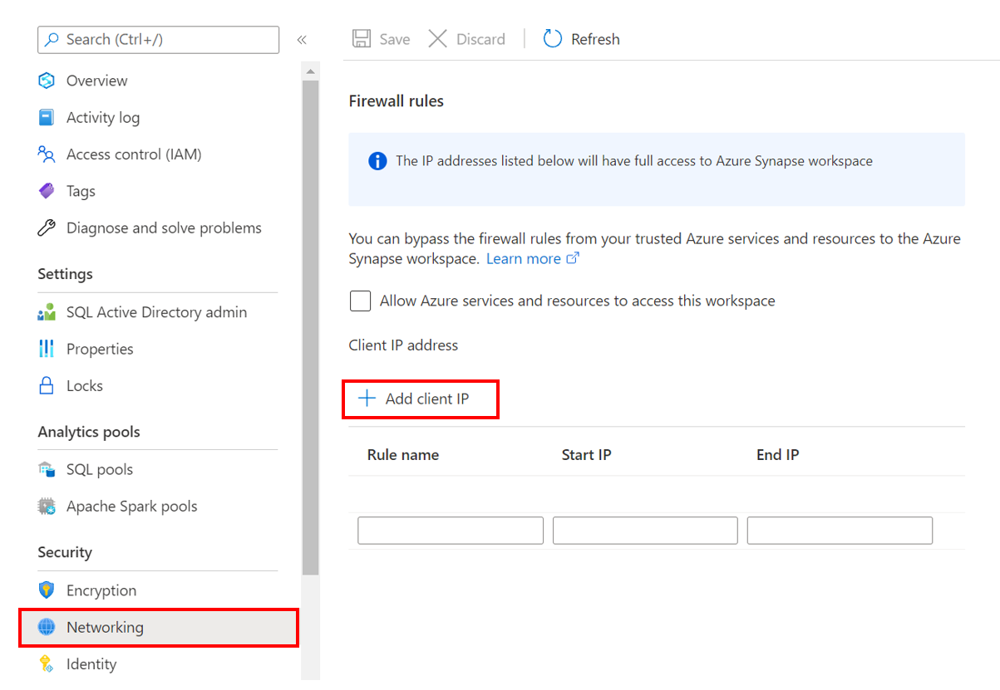
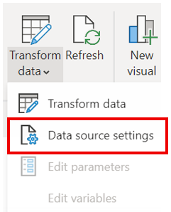

# Deployment Guide 
Please follow the steps below to set up the Azure environment

## Step 1: Download Files
Clone or download this repository and navigate to the project's root directory.

## Step 2: Security Access
### Step 2.1: Add your IP address to Synapse firewall
Before you can upload assests to the Synapse Workspace you will need to add your IP address:
1. Go to the Synapse resouce you created in the previous step. 
2. Navigate to `Networking` under `Security` on the left hand side of the page.
3. At the top of the screen click `+ Add client IP`
      
4. Your IP address should now be visible in the IP list

### Step 2.2: Update storage account permisions 
In order to perform the necessary actions in Synapse workspace, you will need to grant more access.
1. Go to the Azure Data Lake Storage Account for your Synapse Workspace
2. Go to the `Access Control (IAM) > + Add > Add role assignment` 
3. Now search and select the `Storage Blob Data Contributor` role and click "Next" 
4. Click "+ Select members", search and select your username and your adls-spn created in previous steps and click "Select" 
5. Click `Review and assign` at the bottom

[Learn more](https://docs.microsoft.com/azure/synapse-analytics/security/how-to-set-up-access-control)


# Step 3: Upload Sample Dataset
> **Note**: To connect the solution with your Office 365 data, follow the [Deployment_M365 Guide](./Deployment_M365.md) to set up the linked services and pipelines. If you would like to see how the solution works with the sample dataset, continue with the steps below. 

1. Launch the Synapse workspace [Synapse Workspace](https://ms.web.azuresynapse.net/)
2. Select the `subscription` and `workspace` name you are using for this solution accelerator
3. In Synapse Studio, navigate to the `Data` Hub
4. Select `Linked`
5. Under the category `Azure Data Lake Storage Gen2` you'll see an item with a name like `xxxxx(xxxxx- Primary)`
6. Select the container named `govdatahubadlsfs (Primary)`, select "New folder", enter `rawdata` and select "Create", select `Upload` to upload the following sample datasets in the [data folder](https://github.com/microsoft/Azure-Datahub-Solution-Accelerator-for-Government-Recovery-Programs/main/Data/) of this repository to the `rawdata` folder you created: 
    * `programs.csv`
    * `program_types.csv`
    * `contacts.csv`
    * `program_participants.csv`
    * `program_metrics_outcomes.csv`
    * `programtype_metrics_outcomes.csv`


# Step 5: Upload Assets and Run Noteboks
1. Launch the Synapse workspace [Synapse Workspace](https://ms.web.azuresynapse.net/)
2. Go to `Develop`, click the `+`, and click `Import` to select all notebooks from this repository's [folder](https://github.com/microsoft/Azure-Datahub-Solution-Accelerator-for-Government-Recovery-Programs/main/Code/Notebooks)
3. For each of the notebooks, select `Attach to > spark1` in the top dropdown
4. Update the following parameters in `LoadData.ipynb` and publish the changes 
    ```
    data_lake_account_name = ''
    file_system_name = ''
    ```
6. Run `LoadData.ipynb` and `CreateCDM.ipynb`

## Step 6: Power BI Set Up 
1. Open the [Power BI report](https://github.com/microsoft/Azure-Datahub-Solution-Accelerator-for-Government-Recovery-Programs/main/Deployment/PowerBI/GovDataHub-Dashboard.pbix) in this repository

2. Click the Transform data dropdown and click Data source settings 



3. Select the Azure Synapse Workspace connection, select `Change Source...` and provide your SQL Server Database name under Server and click `OK`
    * Navigate to the Synapse Workspace overview page in the Azure Portal, copy the Serverless SQL endpoint
4. Select `Edit Permissions`, under Credentials select `Edit`, sign in to your Microsoft Account, click "OK" and click "Close"
5. Select `Refresh`
